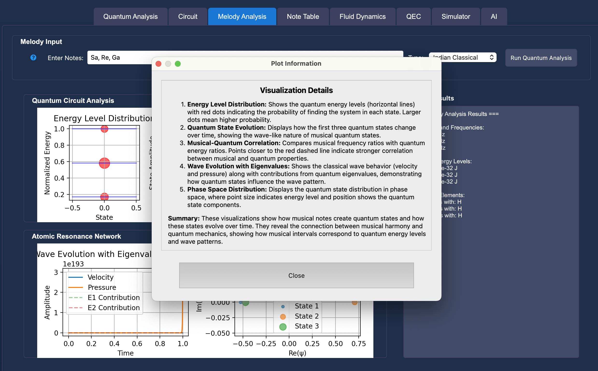
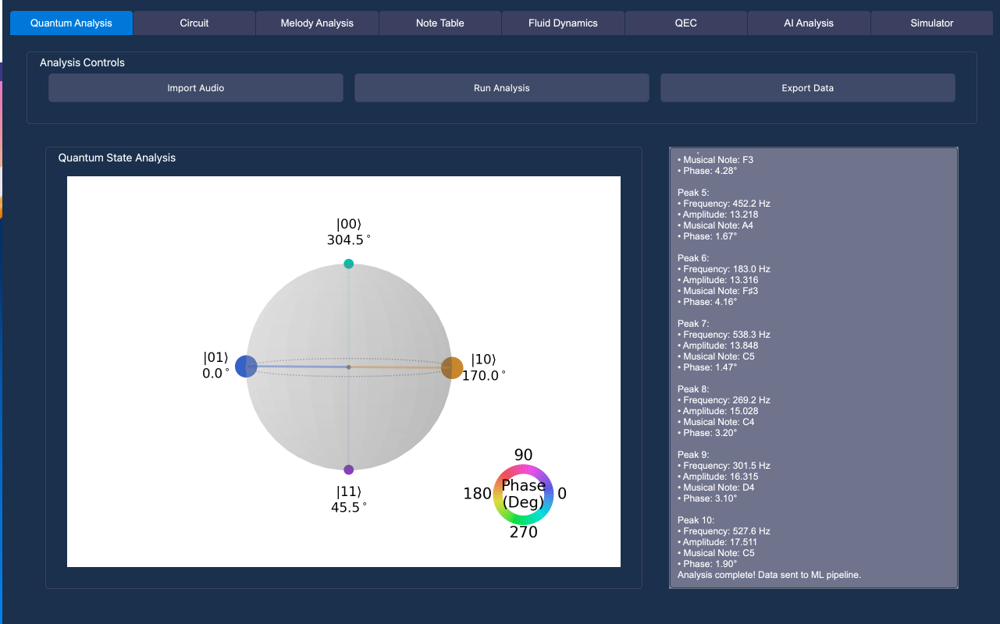
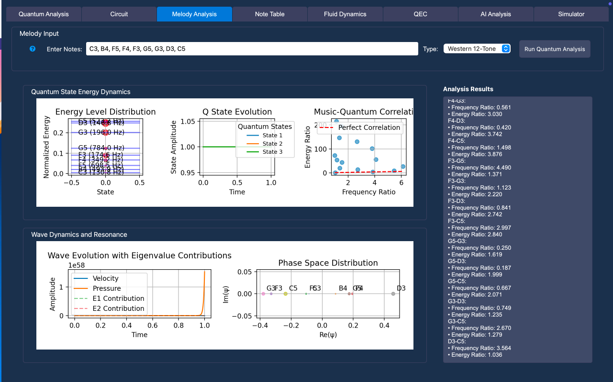
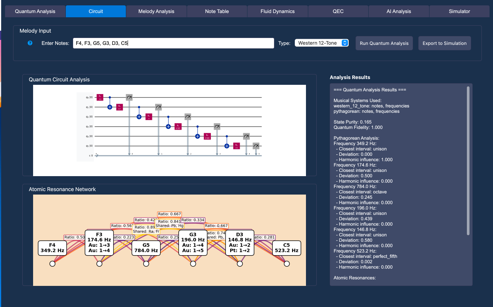
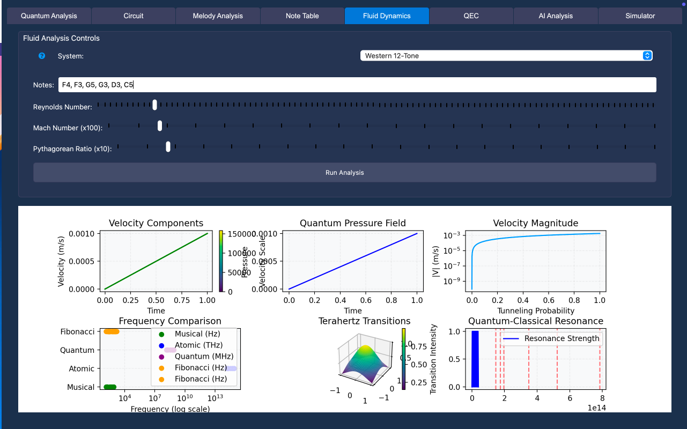
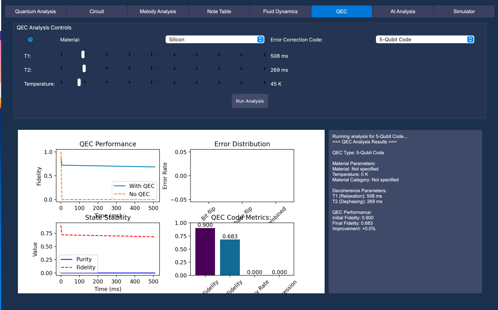
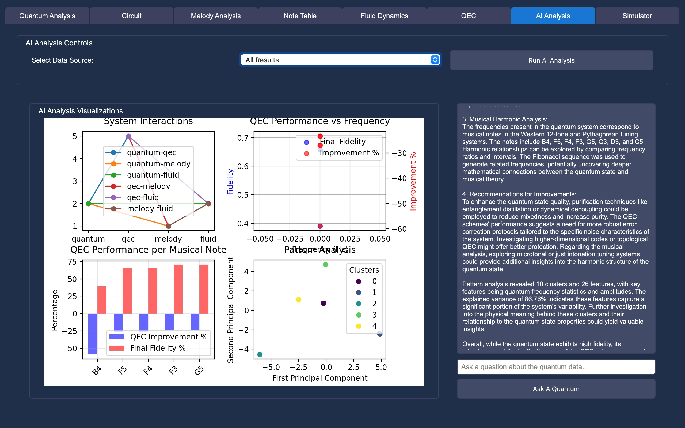

# Quantum Harmonics

Welcome to **Quantum Harmonics**, a cutting-edge interdisciplinary platform that bridges the worlds of **quantum computing**, **music theory**, and **fluid dynamics**. This project aims to explore the interplay between harmonics, resonance, and quantum mechanics through innovative simulations and visualizations.

---
## 🌌 Use Cases: Bridging Quantum, Music, and Physics 🌟

### ***THIS PROJECT IS STILL UNDER DEVELOPMENT
#### 

---

### 1. 🎵 **Quantum Harmonics and Musical Analysis**
- **Harmonic Exploration**: Map musical notes to quantum states, revealing their relationships through Pythagorean ratios and other musical systems.
- **Visualizations**: Create rich, interactive diagrams to display musical arcs, harmonic relationships, and quantum influences.
- **Applications**:
  - Musicology and acoustics research.
  - Novel compositions inspired by quantum phenomena.

---

### 2. 🌀 **Fluid Dynamics Meets Quantum Resonance**
- **Wave Propagation**: Simulate sound waves using simplified Navier-Stokes equations, capturing the evolution of velocity, pressure, and resonance.
- **Quantum-Classical Bridge**: Analyze how classical fluid behaviors connect to quantum principles.
- **Applications**:
  - Aerospace and environmental sciences.
  - Educational tools for fluid mechanics and acoustics.

---

### 3. ⚛️ **Quantum Analysis and Visualization**
- **State Analysis**: Study quantum states, circuits, and phenomena such as phase coherence and fidelity.
- **Interactive Visualizations**: Gain insights into quantum systems through dynamic plots of state probabilities, phase distributions, and coherence metrics.
- **Applications**:
  - Quantum computing research.
  - Demonstrations of quantum behaviors in educational settings.

---

### 4. 🔐 **Quantum Error Correction (QEC)**
- **Error Handling**: Implement and test advanced QEC codes, such as 3-Qubit Bit Flip and 7-Qubit Steane codes.
- **Environment Integration**: Incorporate material properties, temperature, and pressure into QEC analysis to improve real-world robustness.
- **Applications**:
  - Development of reliable quantum computing systems.
  - Benchmarking quantum error correction algorithms.

---

### 5. 🔬 **Material Analysis and Spectroscopy**
- **Frequency Mapping**: Associate quantum frequencies with atomic properties to explore resonance structures.
- **Spectral Analysis**: Identify atomic transitions and quantum-material interactions using advanced spectroscopy tools.
- **Applications**:
  - Material science for quantum devices.
  - Spectroscopy-driven quantum research.

---

### 6. 🔄 **Simulations and Real-Time Experimentation**
- **Dynamic Simulations**: Enable particle simulations influenced by quantum and fluid properties, offering real-time parameter adjustments.
- **User-Friendly Controls**: Experiment with factors like Reynolds number, temperature, and Mach number for in-depth analysis.
- **Applications**:
  - Particle behavior studies.
  - Interactive learning tools for quantum and classical dynamics.

---

### 7. 📚 **Educational and Research Applications**
- **Cross-Disciplinary Learning**: A powerful tool for teaching physics, acoustics, and quantum computing concepts interactively.
- **Integrated Tools**: Combines Qiskit, PyQt6, and matplotlib for a robust and intuitive user experience.
- **Applications**:
  - Educational demonstrations in universities.
  - Research in quantum-inspired engineering and acoustics.

---

## Features

- **Quantum-Music Interactions**  
  Analyze the relationship between quantum states and musical harmonics using Western 12-tone and Pythagorean tuning systems.

- **Quantum Error Correction (QEC)**  
  Explore QEC codes (e.g., 5-Qubit Code) under various conditions to understand fidelity improvements and state stability.

- **Fluid Dynamics Simulations**  
  Study velocity fields, pressure distributions, and quantum-classical resonance effects in fluid systems.

- **Pattern Analysis**  
  Utilize machine learning techniques for clustering and identifying patterns across quantum, musical, and fluid datasets.

- **Intuitive Visualizations**  
  Leverage interactive dashboards for insights into quantum circuits, frequency ratios, phase dynamics, and more.

---

## Works in Progress

- **Particle Simulator**  
  Developing a **particle simulator** to model quantum and classical particle interactions within fluid environments.

- **UI Enhancements**  
  Improving user experience with a more streamlined and intuitive interface.

- **Debugging**  
  Actively refining functionality and fixing bugs to ensure a smooth and reliable application.

---

## Installation

1. Clone the repository:  
   ```bash
   git clone https://github.com/yourusername/quantum-harmonics.git
   
## 📸 Screenshots and Visuals

Here are some screenshots showcasing the features of **Quantum Harmonics**:

### 1. Visualization Details


### 2. QSphere


### 3. Musical Harmonic Analysis


### 4. Circuit and Material Analysis


### 5. Quantum State Energy Dynamics


### 6. Fluid Dynamics


### 7. AI and Machine Learning Analysis



